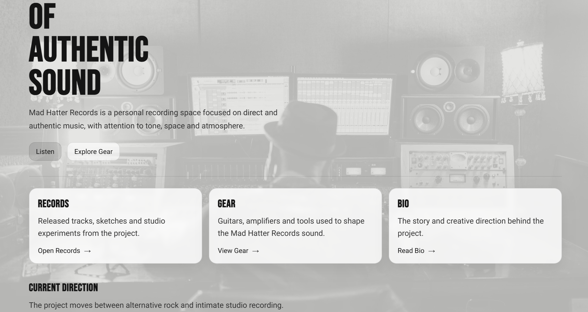
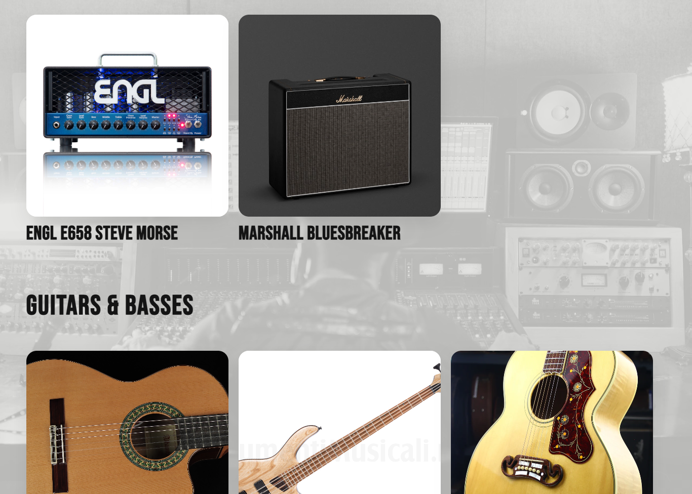

# Mad Hatter Records

Music portfolio website built to showcase original compositions, guitar-driven ideas and creative audio projects.

## 🌐 Live Demo

👉 https://mad-hatter-records.web.app

---

## 📸 Preview

### Homepage

### Gear (API-driven content)

The Gear section is powered by a custom Node.js API.

The service is:
- containerized with Docker  
- built via Google Cloud Build  
- stored in Google Artifact Registry  
- deployed on Google Cloud Run (serverless)  

---

## 🧠 Overview

A simple but production-ready full-stack architecture on Google Cloud.

Static frontend + containerized backend API, designed to deliver dynamic content in a scalable and maintainable way.

---

## 🏗 Architecture

* **Frontend** → Firebase Hosting  
* **Backend API** → Node.js (Express) on Cloud Run  
* **Storage** → Google Cloud Storage (images)  
* **Communication** → REST API  
[ Browser ]
↓
[ Firebase Hosting ]
↓
[ Cloud Run API ]
↓
[ Cloud Storage ]

---

## ⚙️ Tech Stack

* HTML / CSS  
* JavaScript (Vanilla)  
* Node.js (Express)  
* Docker  
* Google Cloud Run  
* Google Cloud Build  
* Google Artifact Registry  
* Google Cloud Storage  
* Firebase Hosting  
* Git & GitHub  

---

## ⚙️ Deployment Workflow

1. Code is pushed to GitHub  
2. Docker image is built via Cloud Build  
3. Image is stored in Artifact Registry  
4. Cloud Run deploys the new revision  

---

## 📁 Project Structure

/
├── public/ # Static frontend (HTML, CSS, JS)
├── gear-api/ # Backend API (Node.js + Docker)
├── firebase.json
├── .firebaserc

---

## 🚀 Running Locally

### Backend

cd gear-api
npm install
node server.js
Frontend
cd public
# open index.html or use a local server

👤 Author

Davide Corleto

